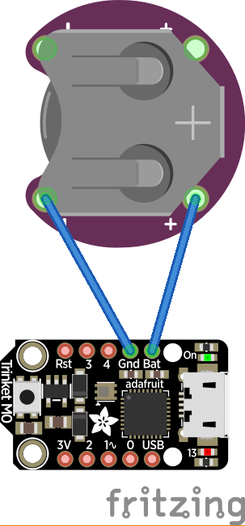
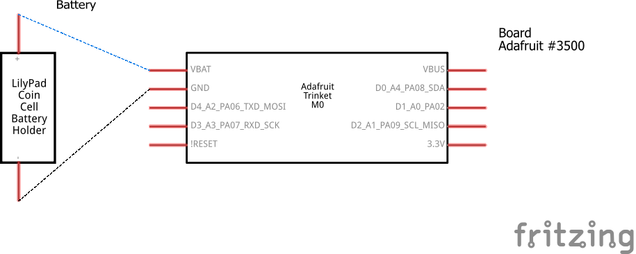
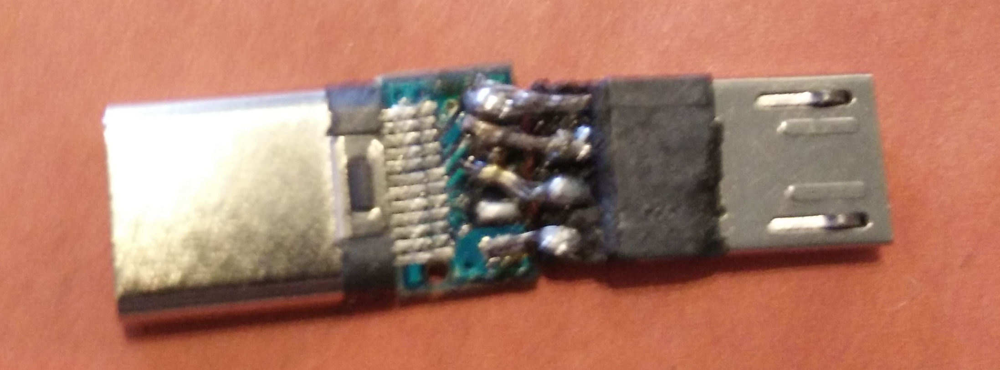

# NX Fusee Loader
Fusee Launcher for the [Adafruit Trinket M0](https://www.adafruit.com/product/3500) board.

Based on [sam fusee launcher](https://github.com/noemu/sam-fusee-launcher).

Built and tested with Arduino SDK.

To get up and running, check the [installation guide](#installation-and-update) and the [hardware guide](#hardware).

---

# Table of Contents
1. [Overview](#overview)
2. [Installation and Update](#installation-and-update)
3. [Hardware](#hardware)
4. [Build](#build)
5. [Custom Payload](#custom-payload)
6. [Thanks to](#thanks-to)

---

# Overview
This project is an open source alternative to the RCM loader.

It relies on the open source [Adafruit Trinket M0](https://www.adafruit.com/product/3500) board and a basic cr2032 battery holder.

The overall design is very simple and requires little soldering to get running.

It uses [Hekate](https://github.com/CTCaer/hekate) as the payload but it can be set up to [launch any compatible payload](#custom-payload).

This repository automatically updates [Hekate](https://github.com/CTCaer/hekate) to the latest version and releases a new firmare with the updated Hekate release thanks these Github Actions workflows
- [check-latest-hekate.yml](.github/workflows/check-latest-hekate.yml) checks daily at 00:00 UTC for a new release
- [build.yml](.github/workflows/build.yml) builds and releases the firmware with the latest hekate update


## LED meanings
* Blinking orange -> searching for Switch in RCM mode
* Red -> no Switch found
* Off (except the power LED) -> finished successfully

---

# Installation and Update
* Download the uf2 file from [the latest release of the firmware](https://github.com/Gamesmes90/nx-fusee-loader/releases/latest)
* Connect the Trinket M0 and press the reset button twice to use [the mass storage bootloader](https://learn.adafruit.com/adafruit-trinket-m0-circuitpython-arduino/uf2-bootloader-details#using-the-mass-storage-bootloader-2929754)
* Open the TRINKETBOOT device and copy the downloaded uf2 file on the device
* Wait for it to update
* When the dotstar led starts to blink orange it means that the firmware is up and running

---

# Hardware
This is the guide to build the required hardware
## Requirements
- [Adafruit Trinket M0](https://www.adafruit.com/product/3500)
- [LilyPad Coin Cell Battery Holder - Switched - 20mm](https://www.sparkfun.com/products/13883) or any clone since it could be hard to find the original in some locations
- Some wire
- A CR2032 battery
- A way to convert micro-usb to usb-c
    - micro-usb to usb-c cable
    - micro-usb to usb-c adapter (female) + usb-c cable
    - micro-usb to usb-a cable + usb-a (female) to usb-c adapter
    - [micro-usb (male) to usb-c (male) adapter](#micro-usb-to-usb-c-adapter-male-to-male)
        - This one is virtually unavailable so it probably needs to be built

## Wiring
Connect the plus pin of the battery holder to the Bat pin of the board
Connect the minus pin of the battery holder to the Gnd pin of the board
### Visual

### Schema


The result should look something like [this](https://www.reddit.com/r/SwitchHaxing/comments/8vze4a/tiny_trinket_m0_and_coin_cell_battery_dongle/)

##### For reference
- [this](https://learn.adafruit.com/assets/45723) is the schematic for the Trinket M0
- [this](https://learn.adafruit.com/assets/45722) is the fabrication print for the Trinket M0
- [this](https://cdn.sparkfun.com/datasheets/Dev/Arduino/Boards/Atmel-42181-SAM-D21_Datasheet.pdf) is the datasheet for the Atmel SAMD21 microcontrollers


## Micro-USB to USB-C adapter (male to male)
[Using a basic usb pinout of 4 pins](https://web.archive.org/web/20160514121804/http://pinoutsguide.com/Slots/usb_3_0_connector_pinout.shtml) a simple converter can be made for this specific purpose.

The final product should look something like this



## Power consumption:
* Idle with error and power LED: 3.5mA
* Idle with only power LED: 1.3mA
* Running: 12.7mA

---

# Build
This is only for developers. If you just want to download the firmware check the [installation guide](#installation-and-update)

It is suggested to check the following guides
- [Trinket M0: Arduino IDE setup](https://learn.adafruit.com/adafruit-trinket-m0-circuitpython-arduino/arduino-ide-setup)
- [Trinket M0: Using Arduino IDE](https://learn.adafruit.com/adafruit-trinket-m0-circuitpython-arduino/using-with-arduino-ide)

## Requirements
- Python 3
    - [requests module](https://pypi.org/project/requests/)
        - `pip install requests`
- [Arduino-IDE](https://www.arduino.cc/en/software) or [Arduino-CLI](https://github.com/arduino/arduino-cli)

## Build steps

For a fast and easy build, use [make](#using-make) (Requires a bash environment)

For a graphical approach, use [Arduino IDE](#with-arduino-ide)


## Download and setup the payload
This step will be mentioned in various points of this guide
* Run [hekateDownloader.py](tools/hekateDownloader.py) script to download the latest Hekate
* Run [binConverter.py](tools/binConverter.py) script with the Hekate binary
    - The following command is executed in the root directory of the repository
        - ```python3 tools/binConverter.py hekate/hekate.bin```
* Move the resulting header file `hekate.h` to the [main](main) folder

### With Arduino IDE

-   #### Setup Arduino IDE
    * Download and install arduino IDE http://www.arduino.cc/en/Main/Software
    * In Arduino: go to "Prefences" and add to "Additional Board Manager URLs" followin URL:
    *  `https://adafruit.github.io/arduino-board-index/package_adafruit_index.json`
    * go to "Tools > Board > Board Manager" and select Type: All and
    * Install "Adafruit SAMD Boards"
    * Select the Trinket M0 with "Tools > Board > Adafruit Trinket M0"
    * Go to Sketch > Include Library > Manage Libraries
    * Install Adafruit DotStar
    * Connect the Trinket m0 to the computer and double click on the Reset Button.
    * The Trinket M0 should be detected automatically (On Win7 install this [driver](https://github.com/adafruit/Adafruit_Windows_Drivers/releases/download/2.2.0/adafruit_drivers_2.2.0.0.exe))
    * Got to Tools > Port and select the connected Trinket M0

-   #### Download and build the project
    * Download this Repository, open main/main.ino with Arduino IDE.
    * [Download and setup the payload](#download-and-setup-the-payload)
    * Then Verify/Compile (Ctrl + R)
    * If no errors appear
    * Upload (Ctrl + U).
    * The Trinket is ready for use.

### With Arduino CLI
* [Install Arduino-CLI](https://arduino.github.io/arduino-cli/0.34/installation/)

-   #### Using Make
    Requires a bash environment with [make](https://www.gnu.org/software/make/)
    * Run ```make sketch``` to build the project, it will automatically [Download and setup the payload](#download-and-setup-the-payload) and install any missing dependencies
    * Run ```make uf2``` to build the uf2 firmware
    -   #### [Makefile](Makefile) Targets
        - `sketch` - Builds the sketch
        - `uf2` - Packages the compiled firmware into a uf2 file
        - `payload` - Downloads the payload (Hekate)
        - `release` - Prepares a folder with the uf2 file for release
        - `clean` - Cleans building folders
        - `clean-header` - Removes the payload header file
        - `clean-all` - Does both `clean` and `clean-header`
        - `all` - runs (In order): `payload`, `sketch`, `uf2` and `release`

-   #### Manually
    These are the same steps the [Makefile](Makefile) goes through
    * [Download and setup the payload](#download-and-setup-the-payload)
    * Install `adafruit:samd` and `"Adafruit DotStar"`
        - ```arduino-cli core install adafruit:samd```
        - ```arduino-cli lib install "Adafruit DotStar"```
        - append the argument `--additional-urls https://adafruit.github.io/arduino-board-index/package_adafruit_index.json` to both commands if the configuration files is not setup with the url (it is what the Makefile assumes), see [arduino-cli configuration](https://arduino.github.io/arduino-cli/0.34/configuration/) for more information
    * Run ```arduino-cli compile --fqbn adafruit:samd:adafruit_trinket_m0 main/main.ino --output-dir build``` to build the project
        - `fqbn` stands for "Fully Qualified Board Name"; It is the board being compiled for
            - For more information check the [arduino platform specification](https://arduino.github.io/arduino-cli/0.21/platform-specification/)
        - `main/main.ino` is the main file of the sketch
        - `output-dir` is the directory where the compiled files will go
    * Download [uf2conv.py](https://raw.githubusercontent.com/microsoft/uf2/master/utils/uf2conv.py) and [uf2families.json](https://raw.githubusercontent.com/microsoft/uf2/master/utils/uf2families.json)
        ```	
        wget -q -nc https://raw.githubusercontent.com/microsoft/uf2/master/utils/uf2conv.py -P tmp
	    wget -q -nc https://raw.githubusercontent.com/microsoft/uf2/master/utils/uf2families.json -P tmp
        ```
    * Run the conversion script with
        - ```python3 tmp/uf2conv.py build/main.ino.hex -f 0x68ed2b88 --output build/firmware.uf2```
            - ```build/main.ino.hex``` is the compiled file to convert
            - `f` stands for `family` and `0x68ed2b88` represents the [SAMD21](https://ww1.microchip.com/downloads/en/DeviceDoc/SAM_D21_DA1_Family_DataSheet_DS40001882F.pdf) microcontroller family, the one used by the Trinket M0
            - `output` is the output file with the directory

---

# Custom payload
This project can theoretically be used to launch any payload since it is just running the [Fusée Gelée](main/fuseegelee.h) exploit.
* Download your favorite payload as a `.bin` file.
* Run the python script `tools/binConverter.py` with the path to the file as an argument
    - `python binConverter.py "C:\pathToMyPayload\hekateNew.bin` or just drag the .bin file on the script

* In the same folder as the .bin file is located, a new .h file should appear. 
* Copy the new file to the `main` folder and in the `main.ino` go to line 6 `#include "hekate_ctcaer_2.3.h"` and rename it to your new file `#include "yourPayload.h"`

Then just [compile](#build) and upload.

##### For reference
- [Vulnerability Disclosure: Fusée Gelée](https://misc.ktemkin.com/fusee_gelee_nvidia.pdf)

---


# Thanks to
* [atlas44](https://github.com/atlas44/sam-fusee-launcher)
* [noemu](https://github.com/noemu)
* [CTCaer](https://github.com/CTCaer/hekate)
* [Ninoh-FOX](https://www.elotrolado.net/hilo_tutorial-crea-tu-propio-dongle-portatil-para-cargar-payloads-it-is-easy_2287822)
* and everyone else i forgot